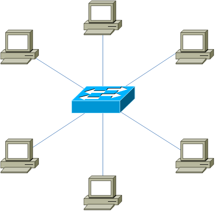
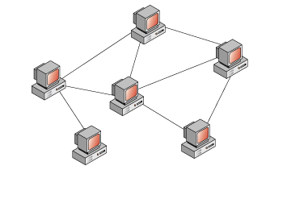

# Networks Book

Author: [Nickolay Leschev](https://github.com/DeMysteriisMundi)
Year: 2020

---

## General

### Organizations

**ISO** - International Organization for Standardization. 

**IEEE** *(англ. Institute of Electrical and Electronics Engineers)* - is a professional association for electronic engineering and electrical engineering. Its objectives are the educational and technical advancement of electrical and electronic engineering, telecommunications, computer engineering and allied disciplines.
More: https://en.wikipedia.org/wiki/Institute_of_Electrical_and_Electronics_Engineers

### Standards

**IEEE 802** - is a family of IEEE standards dealing with local area networks and metropolitan area networks. The services and protocols specified in IEEE 802 map to the lower two layers (Data Link and Physical) of the seven-layer OSI networking reference model. In fact, IEEE 802 splits the OSI Data Link Layer into two sub-layers named logical link control (LLC) and media access control (MAC).
More: https://en.wikipedia.org/wiki/IEEE_802

### Topologies

**Physical Topologies** - how nodes are physically placed and connected.

**Logical Topologies** - how data is goes in the physical topology.

#### Bus Topology

**+**:

- quick and simple to build

**-**:

- at break the whole network will fall

#### Ring Topology

**+**:

- quick and simple to build
- more stable and reliable than *Bus Topology*
- possible to make reservation with second ring

**-**:

- at break the whole network will fall

#### Star Topology

**+**:

- all nodes are connected to the one central node, that works as a repeater 
- more stable and reliable than *Bus Topology* and *Ring Topology*
- at break the only one node will fall

**-**:

- at break with the central node the whole network will fall

#### Full-Mesh Topology

**+**:

- the most reliable

**-**:

- the most expensive
- the hardest to build the big topology
- the hardest to maintenance the big topology

#### Partial-Mesh Topology

**+**:

- lightweight version of *Full-Mesh Topology*

**-**:

- expensive
- hard to build the big topology
- hard to maintenance the big topology

#### Hybrid Topology

**+/-**:

- is a mix of previous topologies with their advantages and disadvantages
- beautiful

### Models

#### OSI

**OSI** - conceptual model of network protocols and standards used as a general model.

#### TCP/IP

**TCP/IP** - conceptual model of network protocols and standards used as a practical model.

### Networks

#### Peer-to-Peer

**Peer-to-Peer** - computing or networking is a distributed application architecture that partitions tasks or workloads between peers. Peers are equally privileged, equipotent participants in the application (node as a client and server both). They are said to form a peer-to-peer network of nodes. Uses *Partial-Mesh*, *Full-Mesh* and *Ring* topologies.

#### Client-Server

**Client-Server** - is a distributed application structure that partitions tasks or workloads between the providers of a resource or service, called servers, and service requesters, called clients. Uses *Star* and *Bus* topologies.

