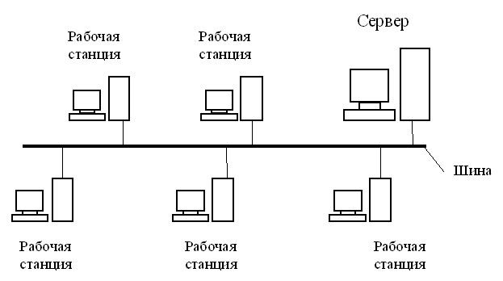
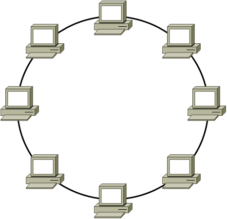
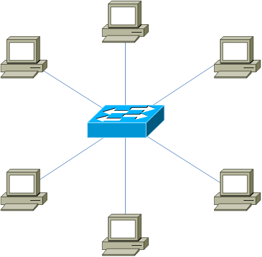
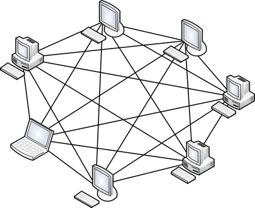
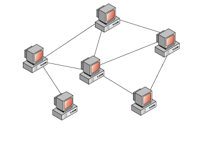
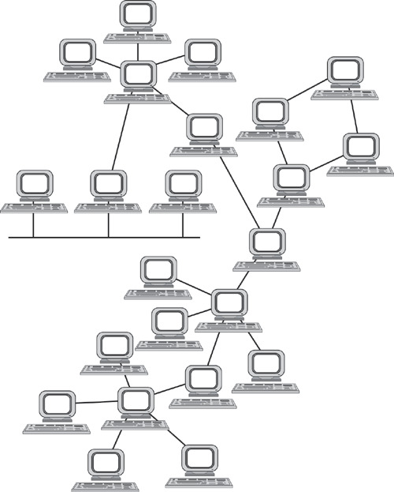
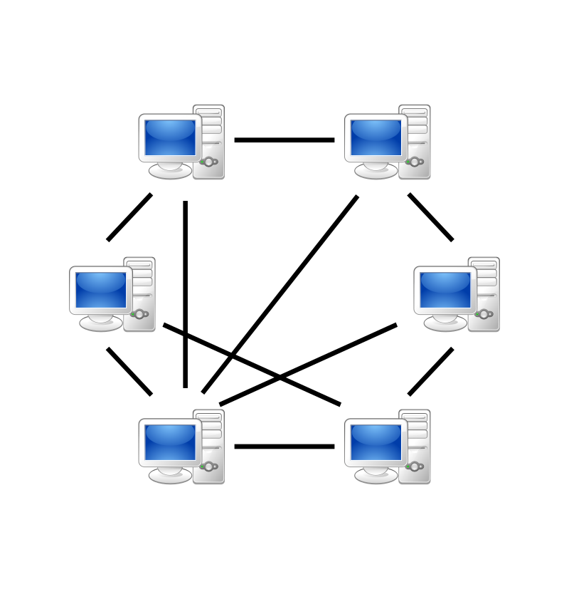
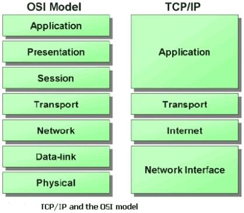

# Network Cheat Sheets

---

## General

### Organizations

**ISO** - International Organization for Standardization.
More: https://en.wikipedia.org/wiki/International_Organization_for_Standardization

**IEEE** *(Institute of Electrical and Electronics Engineers)* - is a professional association for electronic engineering and electrical engineering. Its objectives are the educational and technical advancement of electrical and electronic engineering, telecommunications, computer engineering and allied disciplines.
More: https://en.wikipedia.org/wiki/Institute_of_Electrical_and_Electronics_Engineers

---

### Standards

**IEEE 802** - is a family of IEEE standards dealing with local area networks and metropolitan area networks. The services and protocols specified in IEEE 802 map to the lower two layers (Data Link and Physical) of the seven-layer OSI networking reference model. In fact, IEEE 802 splits the OSI Data Link Layer into two sub-layers named logical link control (LLC) and media access control (MAC).
More: https://en.wikipedia.org/wiki/IEEE_802

**IEEE 802.1Q** - is often referred to as **Dot1q**, is the networking standard that supports virtual LANs (VLANs) on an IEEE 802.3 Ethernet network. The standard defines a system of **VLAN tagging** for Ethernet frames and the accompanying procedures to be used by bridges and switches in handling such frames. The standard also contains provisions for a quality-of-service prioritization scheme commonly known as IEEE 802.1p and defines the Generic Attribute Registration Protocol.
More: http://xgu.ru/wiki/802.1Q

---

## Basics

### Topologies

**Physical Topologies** - it is how nodes are physically placed and connected.
**Logical Topologies** - it is how data goes in the physical topology.

#### Bus Topology

**+**:

- quick and simple to build

**-**:

- at break the whole network will fall

---

#### Ring Topology

**+**:

- quick and simple to build
- more stable and reliable than *Bus Topology*
- possible to make reservation by second ring

**-**:

- at break the whole network will fall

---

#### Star Topology

**+**:

- all nodes are connected to the one central node, that works as a repeater 
- more stable and reliable than *Bus Topology* and *Ring Topology*
- at break the only one node will fall

**-**:

- at break with the central node the whole network will fall

---

#### Full-Mesh Topology

**+**:

- the most reliable

**-**:

- the most expensive
- the hardest to build the big topology
- the hardest to maintenance the big topology

---

#### Partial-Mesh Topology

**+**:

- lightweight version of *Full-Mesh Topology*

**-**:

- expensive
- hard to build the big topology
- hard to maintenance the big topology

---

#### Hybrid Topology

**+/-**:

- is a mix of previous topologies with their advantages and disadvantages
- beautiful

---

### Networks Architecture

#### Peer-to-Peer

**Peer-to-Peer** - is a distributed application architecture that partitions tasks or workloads between peers. Peers are equally privileged, equipotent participants in the application (node as a client and server both). They are said to form a *peer-to-peer* network of nodes. Uses *Partial-Mesh*, *Full-Mesh* and *Ring* topologies.

More: https://en.wikipedia.org/wiki/Peer-to-peerstructure

---

#### Client-Server

**Client-Server** - is a distributed application architecture that partitions tasks or workloads between the providers of a resource or service, called servers, and service requesters, called clients. Uses *star* and *bus* topologies.

More: https://en.wikipedia.org/wiki/Client%E2%80%93server_model

---

### Models

**OSI** - conceptual model of network protocols and standards used as a general model.
**TCP/IP** - conceptual model of network protocols and standards used as a practical model.

#### Physical

...

#### Data-link

...

#### Network

...

#### Transport

...

#### Session

...

#### Presentation

...

#### Application 

...

More: http://xgu.ru/wiki/%D0%A1%D0%B5%D1%82%D0%B5%D0%B2%D0%B0%D1%8F_%D0%BC%D0%BE%D0%B4%D0%B5%D0%BB%D1%8C_OSI

---

## Protocols and Mechanisms

### Physical Level

...

---

### Data Link Level

#### About Data Link Layer

Data Link layer uses *frames* as a data unit. *IEEE 802.2* introduced separation of *Data Link* layer to *MAC* and *LLC* sublayers:

- MAC (Media Access Control) - controls the access to media. Here it is set in which medium the frame is transmitted (*Token Ring*, *Ethernet*, *FDDI*).
- LLC (Logical Link Control) - used for relations with L3. LLC frame may be of 3 types: *informational*, *managerial*, *unnumbered*.

##### LLC

*LLC* frame type determined by procedures described by *IEEE 802.2*. There are 3 procedures:

- LLC1 - without connection and confirmation. Errors are not corrected. Used with datagrams. This procedure uses *unnumbered* frames.
- LLC2 - with connection and confirmation. Errors are corrected. This procedure uses all types of frames. Used in *NetBIOS*/*NetBEUI*, *LAP-D* protocols.
- LLC3 - without connection but with confirmation. Used when high speed and knowledge of whether control information has reached the object is needed.

*LLC* frame contains 3 new headers:

|  DSAP  |  SSAP  | CONTROL |
| :----: | :----: | :-----: |
| 1 byte | 1 byte | 1 byte  |

- DSAP (Destination Service Access Point) - indicates protocol that gets the frame (on the receiving side)
- SSAP (Source Service Access Point) - indicates protocol that sends the frame (on the receiving side)
- Control - indicates if *connection-less* or *connection-oriented* frame

---

#### Token RIng

...

---

#### FDDI

...

---

#### Ethernet

There are several *Ethernet* frame types:

- Ethernet II (IEEE 802.3)
- Ethernet LLC (IEEE 802.3/802.2)
- Ethernet LLC/SNAP (IEEE 802.3/802.2 SNAP)

##### Ethernet II

*Ethernet II* frame includes the next headers:

- Preamble - is necessary for physics signal synchronization
- DA - MAC destination address
- SA - MAC source address
- E-Type - type of L3 payload
- Payload - encapsulated L3 packet. If size < 46 bytes, then filled to 46 bytes. It required for correct collisions identifying.
- FCS - frame check system, codes of correction

---

##### Ethernet LLC

Here *LLC* headers is added, described by *IEEE 802.2*.

*Ethernel LLC* frame includes the next headers:

- Preamble
- SFD (Start Frame Delimeter) - Indicates about frame beginning
- DA
- SA
- Length - length from this header to the end of frame
- DSAP
- SSAP
- Control
- Payload
- FCS

---

##### Ethernet LLC/SNAP

The previous type of *Ethernet* frame contained the only 128 of possible *L3* protocols. *SNAP* headers expand number of pointed protocols, for example, any proprietary protocols.

*Ethernel LLC/SNAP* frame includes the next headers:

- Preamble
- SFD
- DA
- SA
- Length
- DSAP
- SSAP
- Control
- OUI (Organizationally Unique Identifier) - indicates organization identifier
- PID (Protocol ID) - indicates L3 protocol
- Payload
- FCS 

---

#### Switch Principle

To transmit frames, the switch uses a switching table (or *MAC* table). Initially, after the switch is turned on, the table is empty. The switch fills it automatically when receiving frames from the hosts. When the switch receives the frame from the host, it first transfers it in accordance with its rules (described below), and then it remembers the sender's *MAC* address in the frame and maps it to the port on which it was received.

##### Base mechanisms

Switch uses four base mechanisms to frame transmitting:

- Flooding
- Forwarding
- Filtering
- Learning

*Flooding* mechanism used when switch receives frame with unknown *MAC* address (*unknown unicast frame*). Switch transmit it to all ports, so frame reaches the destination host. Also *Flooding* used when switch receives *multicast* or *broadcast* frame.

*Forwarding* mechanism used when switching table contains record what port is located host with this *MAC* address.

*Filtering* mechanism used if the switch receives frame through the specified port, and the destination *MAC* address is accessible through the same port (that is, the switch discards the data). The switch believes that the host has already received this frame, and does not duplicate it.

*Learning* mechanism used if switch receives *unknown unicast frame*. The switch recordings *MAC* address the received frame to switching table.

More: http://xgu.ru/wiki/VLAN#.D0.9F.D1.80.D0.B8.D0.BD.D1.86.D0.B8.D0.BF.D1.8B_.D1.80.D0.B0.D0.B1.D0.BE.D1.82.D1.8B_.D0.BA.D0.BE.D0.BC.D0.BC.D1.83.D1.82.D0.B0.D1.82.D0.BE.D1.80.D0.B0

---

#### VLAN

TODO: write about *IEEE 802.1Q*

**VLAN** - is any broadcast domain that is partitioned and isolated in a computer network at the data link layer. It allows to make devices invisible to each other even if they connected to the one switch or make their visible to each other if they connected to the different switches. *VLAN* is the main mechanism for creating a logical network topology independent of its physical topology in the modern networks.

Tasks:

- reducing the broadcast traffic in the network
- protection from the ARP Spoofing

##### Traffic Tagging

When sending traffic to the network, the computer does not even know in which *VLAN* it is located. This is what the switch thinks. The switch knows that the computer that is connected to a specific port is in the corresponding *VLAN*. The traffic arriving at the port of a particular *VLAN* is no different from the traffic of another *VLAN*. In other words, there is no information about traffic belonging to a specific *VLAN* in it.

However, if traffic from different *VLANs* can come through the port, the switch must somehow distinguish it. To do this, each frame of the traffic must be marked in some special way. The tag should talk about which *VLAN* traffic belongs to.

The most common way to mark this is described in the open *IEEE 802.1Q* standard. There are proprietary protocols that solve similar problems, for example, the *ISL* protocol from *Cisco Systems*, but their popularity is much lower (and declining).

More: http://xgu.ru/wiki/VLAN

---