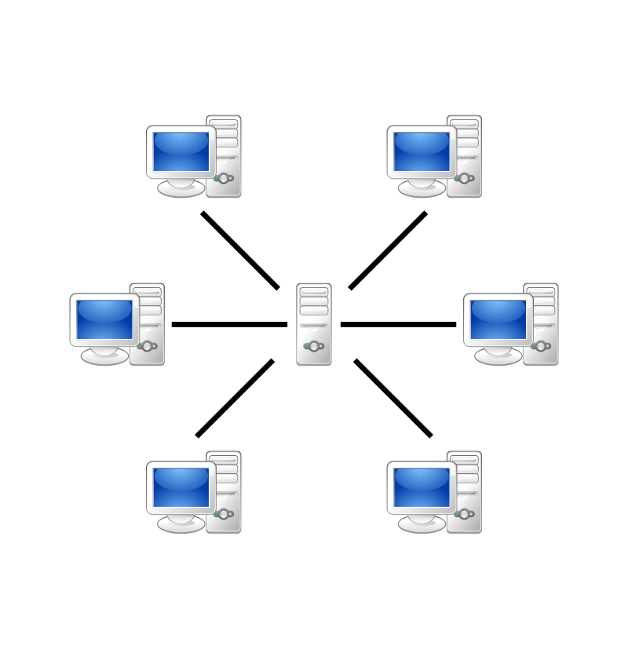

# Network Cheat Sheets

---

## General

### Organizations

**ISO** - International Organization for Standardization.
More: https://en.wikipedia.org/wiki/International_Organization_for_Standardization

**IEEE** *(Institute of Electrical and Electronics Engineers)* - is a professional association for electronic engineering and electrical engineering. Its objectives are the educational and technical advancement of electrical and electronic engineering, telecommunications, computer engineering and allied disciplines.
More: https://en.wikipedia.org/wiki/Institute_of_Electrical_and_Electronics_Engineers

---

### Standards

**IEEE 802** - is a family of IEEE standards dealing with local area networks and metropolitan area networks. The services and protocols specified in IEEE 802 map to the lower two layers (Data Link and Physical) of the seven-layer OSI networking reference model. In fact, IEEE 802 splits the OSI Data Link Layer into two sub-layers named logical link control (LLC) and media access control (MAC).
More: https://en.wikipedia.org/wiki/IEEE_802

**IEEE 802.1Q** - is often referred to as **Dot1q**, is the networking standard that supports virtual LANs (VLANs) on an IEEE 802.3 Ethernet network. The standard defines a system of **VLAN tagging** for Ethernet frames and the accompanying procedures to be used by bridges and switches in handling such frames. The standard also contains provisions for a quality-of-service prioritization scheme commonly known as IEEE 802.1p and defines the Generic Attribute Registration Protocol.
More: http://xgu.ru/wiki/802.1Q

---

## Basics

### Topologies

**Physical Topologies** - it is how nodes are physically placed and connected.
**Logical Topologies** - it is how data goes in the physical topology.

#### Bus Topology

**+**:

- quick and simple to build

**-**:

- at break the whole network will fall

---

#### Ring Topology

**+**:

- quick and simple to build
- more stable and reliable than *Bus Topology*
- possible to make reservation by second ring

**-**:

- at break the whole network will fall

---

#### Star Topology

**+**:

- all nodes are connected to the one central node, that works as a repeater 
- more stable and reliable than *Bus Topology* and *Ring Topology*
- at break the only one node will fall

**-**:

- at break with the central node the whole network will fall

---

#### Full-Mesh Topology

**+**:

- the most reliable

**-**:

- the most expensive
- the hardest to build the big topology
- the hardest to maintenance the big topology

---

#### Partial-Mesh Topology

**+**:

- lightweight version of *Full-Mesh Topology*

**-**:

- expensive
- hard to build the big topology
- hard to maintenance the big topology

---

#### Hybrid Topology

**+/-**:

- is a mix of previous topologies with their advantages and disadvantages
- beautiful

---

### Networks Architecture

#### Peer-to-Peer

**Peer-to-Peer** - computing or networking is a distributed application architecture that partitions tasks or workloads between peers. Peers are equally privileged, equipotent participants in the application (node as a client and server both). They are said to form a peer-to-peer network of nodes. Uses *Partial-Mesh*, *Full-Mesh* and *Ring* topologies.

More: https://en.wikipedia.org/wiki/Peer-to-peer

---

#### Client-Server

**Client-Server** - is a distributed application structure that partitions tasks or workloads between the providers of a resource or service, called servers, and service requesters, called clients. Uses *Star* and *Bus* topologies.

More: https://en.wikipedia.org/wiki/Client%E2%80%93server_model

---

### Models

**OSI** - conceptual model of network protocols and standards used as a general model.
**TCP/IP** - conceptual model of network protocols and standards used as a practical model.

#### Physical

...

#### Data-link

...

#### Network

...

#### Transport

...

#### Session

...

#### Presentation

...

#### Application 

...

More: http://xgu.ru/wiki/%D0%A1%D0%B5%D1%82%D0%B5%D0%B2%D0%B0%D1%8F_%D0%BC%D0%BE%D0%B4%D0%B5%D0%BB%D1%8C_OSI

---

## Protocols and Mechanisms

### Physical Level

...

---

### Data-Link Level

TODO: about switch commutations

---

#### VLAN

**VLAN** - is any broadcast domain that is partitioned and isolated in a computer network at the data link layer. It allows to make devices invisible to each other even if they connected to the one switch or make their visible to each other if they connected to the different switches. *VLAN* is the main mechanism for creating a logical network topology independent of its physical topology in the modern networks.

Task:

- reducing the broadcast traffic in the network
- protection from the ARP Spoofing

More: http://xgu.ru/wiki/VLAN

##### Traffic Tagging

When sending traffic to the network, the computer does not even know in which VLAN it is located. This is what the switch thinks. The switch knows that the computer that is connected to a specific port is in the corresponding VLAN. The traffic arriving at the port of a particular VLAN is no different from the traffic of another VLAN. In other words, there is no information about traffic belonging to a specific VLAN in it.

However, if traffic from different VLANs can come through the port, the switch must somehow distinguish it. To do this, each frame of the traffic must be marked in some special way. The tag should talk about which VLAN traffic belongs to.

The most common way to mark this is described in the open *IEEE 802.1Q* standard. There are proprietary protocols that solve similar problems, for example, the *ISL* protocol from Cisco Systems, but their popularity is much lower (and declining).

---